# Reporte de Explotación | Writeup: Fuerza Bruta SSH, Movimiento Lateral mediante Exfiltración de Pistas y Escalada de Privilegios Vertical vía Sudo Abuse (Python3).

El presente documento detalla el proceso de analisis de vulnerabilidades y pruebas de penetracion (*Pentesting*) realizado sobre la maquina **Pequeñas Mentirosas**, un entorno controlado desplegado localmente mediante la plataforma **DockerLabs**.

El objetivo es identificar servicios expuestos, explotar fallos de configuracion o vulnerabilidades de software, y escalar privilegios hasta obtener acceso total como el usuario administrador (`root`).

- **Curso:** [Ciberseguridad BIOS]
- **Auditoria:** [NGalarza-sysec]
- **Objetivo de Evaluacion:** Máquina Pequeñas Mentirosas (IP: `172.17.0.2`)

>[!IMPORTANT]
>
> **Vulnerabilidades Explotadas:**
>
> 1. **Ataque de Fuerza Bruta SSH (Acceso Inicial):** Credenciales débiles en el servicio SSH (`22/tcp`) indexadas en diccionarios conocidos (`rockyou.txt`), permitiendo el compromiso de la cuenta de usuario (`a`).
> 2. **Exfiltración Interna de Información / Pistas:** Exposición de archivos de texto en el sistema de archivos (`/srv/ftp/pista_fuerza_bruta.txt` y `/srv/ftp/clave_aes.txt`) que revelan vectores para movimiento lateral.
> 3. **Escalada de Privilegios Horizontal (Movimiento Lateral):** Ataque de fuerza bruta mediante `Hydra` sobre SSH aprovechando la identificación del usuario secundario (`spencer`).
> 4. **Escalada de Privilegios Vertical (Sudo Abuse / GTFOBins):** Malconfiguración en la regla `sudoers` que permite al usuario `spencer` ejecutar el intérprete `/usr/bin/python3` como `root` sin proporcionar contraseña (`NOPASSWD`), permitiendo la ejecución de comandos con máximos privilegios (`spencer` -> `root`).

## 1.  Escaneo Profundo de Puerto (Nmap + Flags)
>[!NOTE] 
> **Objetivo:**
> 
>  Identificar Software exacto y buscar posibles vulnerabilidades.
> Enviamos un escaneo con scripts por defecto (`-sC`) y detección de versiones (`-sV`) dirigido a los puertos identificados. 
> 
> ```bash
> sudo nmap -p 22,80 -sCV 172.17.0.2
> ```
> 
> **Desglose del comando y flags utilizados:**
> 
> `-p 22,80:` Restringe el análisis únicamente a los puertos de interés identificados previamente.
> 
> `-sC:` Ejecuta el conjunto de scripts de reconocimiento estándar del Nmap Scripting Engine (NSE).
> 
> `-sV:` Inspeciona los puertos abiertos para identificar las versiones exactas de los servicios y banners expuestos.
> 
> `-oN servicios:` Guarda la salida detallada en el archivo `servicios.`
> 
> 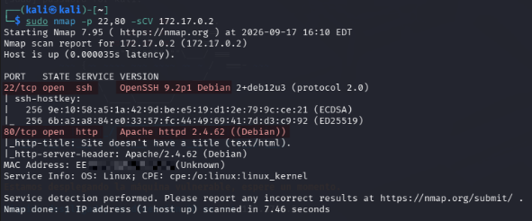
> 
> **Resultado | Puertos Abiertos Identificados:**
> * `22/tcp -SSH`
> * `80/tcp -HTTP`

## 2.  Impeccion del Servicio Web | Reconocimiento HTTP
>[!NOTE]
> Navegar al servicio web expuesto en el puerto `80/tcp` y analizar la aplicación.
> 
> 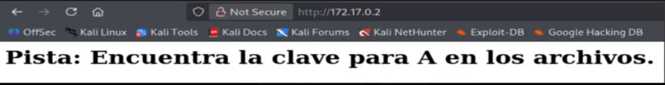
> 
> **Deducción:** 
> Tras inspeccionar la aplicación web, se infiere la existencia del usuario `A` como posible candidato para autenticación.

 ## 3.  Ataque de Fuerza Bruta: Hydra - Usuario `a`
>[!NOTE] 
> Ejecutar un ataque de diccionario contra el servicio SSH para obtener la contraseña del `usuario a`.
> 
> ```bash
> hydra -l a -P /usr/share/wordlists/rockyou.txt ssh://172.17.0.2 -t 4
> ```
> 
> `-l a`: Define un nombre de usuario específico `(a)` como objetivo del ataque.
> 
> `-P /usr/share/wordlists/rockyou.txt`: Especifica la ruta hacia la lista de palabras/diccionario de contraseñas.
> 
> `ssh://172.17.0.2`: Indica el protocolo objetivo `(ssh)` y la dirección IP de la víctima.
> 
> `-t 4`: Ajusta el número de tareas o hilos concurrentes en paralelo (4 conexiones en paralelo).
> 
> 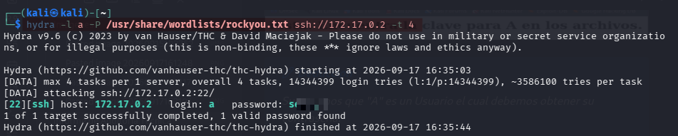
> 
> ### Conclusion del Ataque de Fuerza Bruta
> 
> El ataque implementado con `Hydra` fue exitoso, logrando vulnerar la seguridad del servicio SSH en menos de un minuto debido al uso de una contraseña débil indexada en el diccionario `rockyou.txt.`
> 
> * **Usuario Vulnerado:** `a`
> * **Contraseña Identificada:** `secret`
  
## 4. Establecimiento de Conexión Remota
>[!NOTE]
> Utilizando las credenciales obtenidas en la fase de fuerza bruta (Usuario: `a`), se procede a realizar una conexion remota vía SSH hacia el contenedor objetivo para obtener una consola interactiva en el sistema.
> 
> ```bash
> ssh a@172.17.0.2
> ```
> 
> **Usuario**: `a`
> **Password**: `secret`
> **Estado**: Acceso inicial concedido.
> 
> 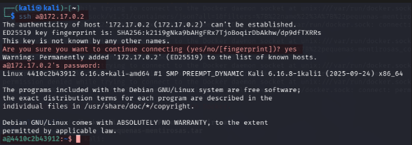

## 5. Escalada de Privilegios e Inspección Interna
>[!NOTE]
> Se ejecuta el comando `sudo -l` para verificar si el acceso inicial cuenta con privilegios de ejecucion delegados por el administrador.
> 
> ```bash
> sudo -l
> ```
> 
> **Resultado obtenido**: `User a may not run sudo on 419df0fb739a.`
> 
> **Análisis**: El sistema indica que el usuario `a` no tiene permisos `sudo`. Se procede a inspeccionar el sistema de archivos de forma manual en busca de vectores alternativos.
> 
> 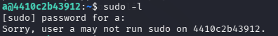

## 6. Movimiento Lateral (Usuario `spencer`)
>[!NOTE]
> Como el usuario `a`no posee permisos de administración, se inspecciona el sistema de archivos buscando archivos de texto o pistas de configuración.
> 
> ```bash
> find / -type f -iname "*.txt" 2>/dev/null  
> ```
> 
> **`find /`**: Inicia la búsqueda recursiva a partir del directorio raíz (`/`).
> 
> **`-type f`**: Restringe la búsqueda para encontrar únicamente archivos regulares (omite directorios, pipes, sockets, etc.).
> 
> **`-iname "*.txt"`**: Busca archivos cuya extensión sea `.txt` ignorando mayúsculas/minúsculas (case-insensitive).
> 
> **`2>/dev/null`**: Redirige los mensajes de error (stderr, como "Permission denied") al dispositivo nulo para no ensuciar la salida en pantalla.
> 
> **Resultado de la inspección:**
> Se localizan y leen los archivos **`/srv/ftp/clave_aes.txt`** y **`/srv/ftp/pista_fuerza_bruta.txt`** con el comando **`cat`** los cuales revelan información que confirma la presencia del segundo usuario: **`spencer`**.
> 
> 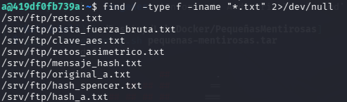
> 
> ```bash
> cat /srv/ftp/clave_aes.txt`
> ```
> 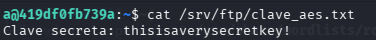
> 
> ```bash
> cat /srv/ftp/pista_fuerza_bruta.txt 
> ```
> 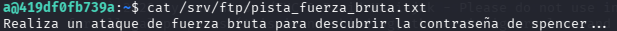

## 7. Ataque fuerza Bruta a Usuario `spencer`.
>[!NOTE]
> Se ejecuta un ataque de fuerza bruta con `Hydra` desde la terminal atacante (Kali Linux) hacia el usuario **`spencer`**.
> 
> ```bash
> hydra -l spencer -P /usr/share/wordlists/rockyou.txt ssh://172.17.0.2 -t 4
> ```
> 
> 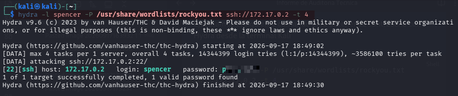
> 
> **Conclusión del Ataque:**
> Ataque exitoso logrando comprometer el acceso SSH del segundo usuario.
> 
> **Usuario Vulnerado**: `spencer`
> **Contraseña Identificada**: `password1`

## 8. Escalada de Privilegios Vertical (`root`)
>[!NOTE]
> ### Verificación de Permisos Sudo de `spencer`
> 
> Una vez posicionados en la cuenta de **`spencer`**  (**`ssh spencer@172.17.0.2`**), comprobamos sus privilegios delegados:
> 
> ```bash
> sudo -l
> ```
> 
> 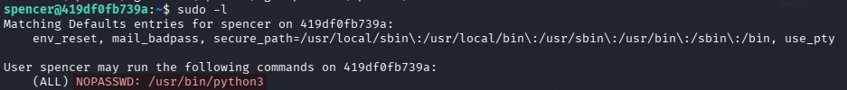
> 
> `User spencer may run the following commands on 419df0fb739a: 
> **`(ALL) NOPASSWD: /usr/bin/python3`**
> 
> ### Secuestro del Flujo mediante `Python3` (Sudo Escape)
> 
> Aprovechando esta vulnerabilidad de configuración, consultamos la referencia técnica en GTFOBins y ejecutamos una inyección en línea mediante **`python3`** para forzar al intérprete a spawnear una consola de comandos secundaria (**`/bin/sh`**).
> 
> Al correr bajo el contexto de **`sudo`**, la nueva terminal hereda los máximos privilegios del sistema (**`root`**).
> 
> **Obtuvimos el comando desde la siguiente base de datos:**
> 
> 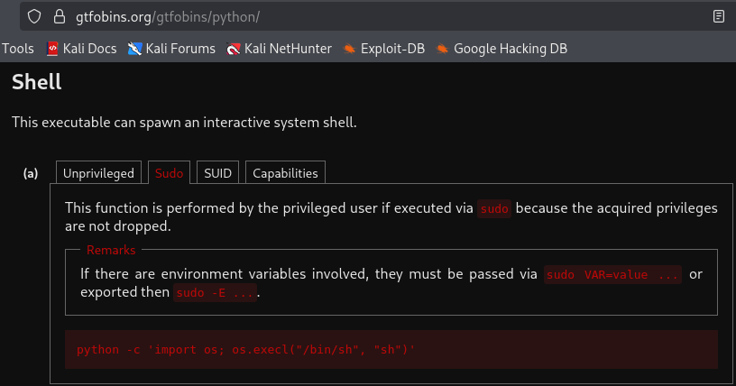
> 
> **Desglose del comando y funciones utilizadas:**
> 
> ```bash
> sudo python3 -c 'import os; os.execl("/bin/sh", "sh")'
> ```
> 
> **`sudo`**: Ejecuta la instrucción aprovechando los privilegios de **`root`** permitidos en el archivo **`sudoers`**.
> 
> **`python3`**: Invoca el entorno ejecutable del intérprete Python.
> 
> **`-c`**: Permite pasar un comando o script directamente como cadena de texto desde la consola.
> 
> **`import os`**: Carga el módulo estándar **`os`**, que permite interactuar con el sistema operativo subyacente.
> 
> **`os.execl("/bin/sh", "sh")`**: Reemplaza el proceso de Python actual por una nueva imagen ejecutable del shell **`/bin/sh`**. Como el proceso invocador corre con **`sudo`**, la nueva consola mantiene y hereda la identidad de **`root`**.
> 
> **Resultado y Confirmación:**
> 
> ```bash
> spencer@419df0fb739a:~$ sudo python3 -c 'import os; os.execl("/bin/sh", "sh")'
> # whoami
> root
> # id
> uid=0(root) gid=0(root) groups=0(root)
> ```
> 
> 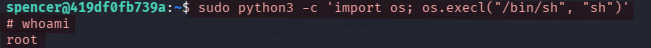

## 9. Recomendaciones de Mitigación
>[!WARNING]
> * 1- **Fortalecimiento de Credenciales (SSH Hardening):** Implementar políticas de contraseñas complejas o autenticación obligatoria mediante claves SSH (**`Public Key Authentication`**) para prevenir ataques de fuerza bruta automatizados con diccionarios como **`rockyou.txt.`**
> 
> * 2- **Principio de Menor Privilegio (Sudoers Restrictivo):** Evitar otorgar permisos **`sudo`** sin contraseña sobre intérpretes interactivos o lenguajes de programación (**`python3, bash, perl`**), ya que permiten la evasión directa del entorno para obtener shells interactivas como **`root`** (Sudo Escape / GTFOBins).
> 
> * 3- **Limpieza de Información Sensible:** Eliminar archivos de prueba, pistas o backups almacenados en directorios públicos/compartidos del sistema como **`/srv/ftp/`**.
